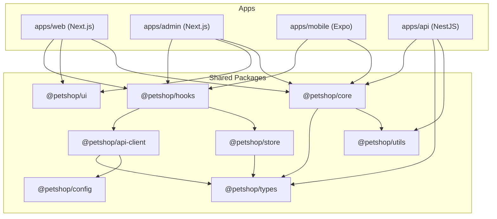

# 🏗️ MONOREPO ARCHITECTURE — Petshop Platform

> Arsitektur monorepo dengan **shared core** agar business logic & API client bisa dipakai ulang di Web, Mobile (React Native), dan Desktop (Electron/Tauri).

---

## Tech Foundation

| Layer | Tool |
|-------|------|
| Monorepo | **Turborepo** |
| Package Manager | **pnpm** (workspaces) |
| Language | **TypeScript** (strict, shared tsconfig) |
| Backend | **NestJS** (standalone API server) |
| Web | **Next.js** (App Router) |
| Mobile | **React Native** (Expo) |
| Desktop | **Electron** atau **Tauri** (future) |
| Database | **Supabase** (PostgreSQL) |

---

## Folder Structure

```
petshop/
├── apps/                          # Platform-specific apps
│   ├── web/                       # Next.js web app (customer-facing)
│   │   ├── app/                   # App Router pages
│   │   │   ├── (auth)/            # Login, Register
│   │   │   ├── (shop)/            # Browse, Product, Cart
│   │   │   ├── (account)/         # Profile, Orders, Pets, Loyalty
│   │   │   ├── booking/           # Grooming & Hotel booking
│   │   │   ├── checkout/          # Checkout flow
│   │   │   └── layout.tsx
│   │   ├── components/            # Web-specific UI components
│   │   │   ├── layout/            # Header, Footer, Sidebar
│   │   │   ├── product/           # ProductCard, ProductGrid
│   │   │   ├── cart/              # CartDrawer, CartItem
│   │   │   ├── booking/           # BookingCalendar, SlotPicker
│   │   │   └── shared/            # Buttons, Modals, Inputs (web)
│   │   ├── public/
│   │   ├── styles/
│   │   ├── next.config.ts
│   │   ├── tailwind.config.ts
│   │   └── package.json
│   │
│   ├── admin/                     # Next.js admin dashboard
│   │   ├── app/
│   │   │   ├── dashboard/         # Overview metrics
│   │   │   ├── products/          # CRUD produk
│   │   │   ├── orders/            # Manage orders
│   │   │   ├── bookings/          # Manage bookings
│   │   │   ├── inventory/         # Stock management
│   │   │   ├── banners/           # CMS banner
│   │   │   ├── customers/         # Customer list
│   │   │   ├── financial/         # Owner-only financial
│   │   │   └── settings/          # Store settings
│   │   ├── components/
│   │   └── package.json
│   │
│   ├── mobile/                    # React Native (Expo)
│   │   ├── app/                   # Expo Router (file-based routing)
│   │   │   ├── (tabs)/            # Bottom tab navigation
│   │   │   │   ├── home.tsx       # Home / browse
│   │   │   │   ├── categories.tsx
│   │   │   │   ├── cart.tsx
│   │   │   │   ├── booking.tsx
│   │   │   │   └── profile.tsx
│   │   │   ├── product/[slug].tsx
│   │   │   ├── checkout/
│   │   │   ├── order/[id].tsx
│   │   │   └── auth/
│   │   ├── components/            # Mobile-specific UI
│   │   │   ├── ProductCard.tsx
│   │   │   ├── CartSheet.tsx
│   │   │   └── BookingPicker.tsx
│   │   ├── assets/
│   │   ├── app.json
│   │   └── package.json
│   │
│   └── api/                       # NestJS standalone API server
│       ├── src/
│       │   ├── modules/
│       │   │   ├── auth/          # Auth module (OTP, Google, JWT)
│       │   │   │   ├── auth.controller.ts
│       │   │   │   ├── auth.service.ts
│       │   │   │   ├── auth.guard.ts
│       │   │   │   └── auth.module.ts
│       │   │   ├── products/      # Products CRUD + search
│       │   │   │   ├── products.controller.ts
│       │   │   │   ├── products.service.ts
│       │   │   │   └── products.module.ts
│       │   │   ├── orders/        # Order management
│       │   │   ├── cart/          # Cart management
│       │   │   ├── bookings/      # Booking + slot management
│       │   │   ├── payments/      # Midtrans/Xendit integration
│       │   │   ├── shipping/      # RajaOngkir/Biteship
│       │   │   ├── notifications/ # WhatsApp + Push
│       │   │   ├── loyalty/       # Points & vouchers
│       │   │   ├── reviews/       # Review & rating
│       │   │   ├── pets/          # Pet profiles
│       │   │   ├── banners/       # CMS banners
│       │   │   ├── inventory/     # Stock movements
│       │   │   ├── upload/        # File upload (Supabase Storage)
│       │   │   └── analytics/     # Dashboard & financial
│       │   ├── common/
│       │   │   ├── guards/        # RoleGuard, AuthGuard
│       │   │   ├── decorators/    # @CurrentUser, @Roles
│       │   │   ├── interceptors/  # Logging, Transform
│       │   │   ├── filters/       # Exception filters
│       │   │   └── pipes/         # Validation pipes
│       │   ├── config/
│       │   │   ├── supabase.ts
│       │   │   ├── midtrans.ts
│       │   │   └── app.config.ts
│       │   ├── app.module.ts
│       │   └── main.ts
│       ├── test/
│       └── package.json
│
├── packages/                      # Shared packages (REUSABLE)
│   ├── core/                      # Business logic (platform-agnostic)
│   │   ├── src/
│   │   │   ├── services/          # Business logic services
│   │   │   │   ├── cart.service.ts       # Cart calculations
│   │   │   │   ├── pricing.service.ts    # Price, discount, tax logic
│   │   │   │   ├── shipping.service.ts   # Shipping rules & validation
│   │   │   │   ├── booking.service.ts    # Slot validation, overbooking check
│   │   │   │   ├── loyalty.service.ts    # Points calculation
│   │   │   │   ├── voucher.service.ts    # Voucher validation
│   │   │   │   └── inventory.service.ts  # Stock validation
│   │   │   ├── validators/        # Shared validation rules
│   │   │   │   ├── order.validator.ts
│   │   │   │   ├── booking.validator.ts
│   │   │   │   └── product.validator.ts
│   │   │   ├── constants/         # Shared constants
│   │   │   │   ├── order-status.ts
│   │   │   │   ├── payment-status.ts
│   │   │   │   ├── booking-status.ts
│   │   │   │   └── shipping-rules.ts
│   │   │   └── index.ts
│   │   ├── package.json
│   │   └── tsconfig.json
│   │
│   ├── types/                     # Shared TypeScript types
│   │   ├── src/
│   │   │   ├── user.ts
│   │   │   ├── product.ts
│   │   │   ├── order.ts
│   │   │   ├── cart.ts
│   │   │   ├── booking.ts
│   │   │   ├── pet.ts
│   │   │   ├── payment.ts
│   │   │   ├── shipping.ts
│   │   │   ├── loyalty.ts
│   │   │   ├── review.ts
│   │   │   ├── notification.ts
│   │   │   ├── banner.ts
│   │   │   ├── voucher.ts
│   │   │   └── index.ts           # Re-export all
│   │   ├── package.json
│   │   └── tsconfig.json
│   │
│   ├── api-client/                # API client SDK (fetch wrapper)
│   │   ├── src/
│   │   │   ├── client.ts          # Base HTTP client (fetch/axios)
│   │   │   ├── auth.api.ts        # Auth endpoints
│   │   │   ├── products.api.ts    # Product endpoints
│   │   │   ├── cart.api.ts        # Cart endpoints
│   │   │   ├── orders.api.ts      # Order endpoints
│   │   │   ├── bookings.api.ts    # Booking endpoints
│   │   │   ├── shipping.api.ts    # Shipping endpoints
│   │   │   ├── payments.api.ts    # Payment endpoints
│   │   │   ├── pets.api.ts        # Pet endpoints
│   │   │   ├── loyalty.api.ts     # Loyalty endpoints
│   │   │   ├── reviews.api.ts     # Review endpoints
│   │   │   └── index.ts
│   │   ├── package.json
│   │   └── tsconfig.json
│   │
│   ├── hooks/                     # Shared React hooks (web + mobile)
│   │   ├── src/
│   │   │   ├── useAuth.ts
│   │   │   ├── useCart.ts
│   │   │   ├── useProducts.ts
│   │   │   ├── useOrders.ts
│   │   │   ├── useBooking.ts
│   │   │   ├── usePets.ts
│   │   │   ├── useLoyalty.ts
│   │   │   ├── useNotifications.ts
│   │   │   └── index.ts
│   │   ├── package.json
│   │   └── tsconfig.json
│   │
│   ├── store/                     # Shared Zustand stores
│   │   ├── src/
│   │   │   ├── auth.store.ts
│   │   │   ├── cart.store.ts
│   │   │   ├── ui.store.ts
│   │   │   └── index.ts
│   │   ├── package.json
│   │   └── tsconfig.json
│   │
│   ├── utils/                     # Shared utility functions
│   │   ├── src/
│   │   │   ├── format.ts          # formatCurrency, formatDate
│   │   │   ├── validation.ts      # Email, phone, etc.
│   │   │   ├── distance.ts        # Haversine distance calc
│   │   │   ├── slug.ts            # Slug generator
│   │   │   ├── order-number.ts    # Generate order/booking number
│   │   │   └── index.ts
│   │   ├── package.json
│   │   └── tsconfig.json
│   │
│   ├── config/                    # Shared config & env
│   │   ├── src/
│   │   │   ├── env.ts             # Environment variables schema
│   │   │   ├── constants.ts       # App-wide constants
│   │   │   └── index.ts
│   │   ├── package.json
│   │   └── tsconfig.json
│   │
│   ├── ui/                        # Shared UI primitives (web only)
│   │   ├── src/
│   │   │   ├── button.tsx
│   │   │   ├── input.tsx
│   │   │   ├── modal.tsx
│   │   │   ├── badge.tsx
│   │   │   ├── card.tsx
│   │   │   └── index.ts
│   │   ├── package.json
│   │   └── tsconfig.json
│   │
│   └── tsconfig/                  # Shared TypeScript configs
│       ├── base.json
│       ├── nextjs.json
│       ├── react-native.json
│       ├── nestjs.json
│       └── package.json
│
├── supabase/                      # Supabase local config
│   ├── migrations/                # SQL migrations (versioned)
│   │   ├── 001_users.sql
│   │   ├── 002_categories_products.sql
│   │   ├── 003_carts_orders.sql
│   │   ├── 004_bookings_services.sql
│   │   ├── 005_loyalty_vouchers.sql
│   │   ├── 006_reviews_wishlists.sql
│   │   ├── 007_notifications.sql
│   │   ├── 008_banners_locations.sql
│   │   ├── 009_indexes.sql
│   │   └── 010_rls_policies.sql
│   ├── seed/                      # Seed data
│   │   ├── categories.sql
│   │   ├── products.sql
│   │   └── services.sql
│   ├── functions/                 # Edge functions
│   │   ├── payment-webhook/
│   │   ├── send-whatsapp/
│   │   ├── expire-orders/
│   │   └── expire-points/
│   └── config.toml
│
├── docs/                          # Documentation
│   ├── prd.md                     # Product Requirements
│   ├── api-spec.md                # API specification
│   ├── database-erd.md            # Entity Relationship Diagram
│   └── deployment.md              # Deployment guide
│
├── .github/
│   └── workflows/
│       ├── ci.yml                 # Lint + test
│       ├── deploy-web.yml         # Deploy web to Vercel
│       ├── deploy-api.yml         # Deploy API
│       └── deploy-mobile.yml      # EAS build
│
├── turbo.json                     # Turborepo pipeline config
├── pnpm-workspace.yaml            # pnpm workspaces
├── package.json                   # Root package.json
├── .env.example
├── .gitignore
└── README.md
```

---

## Dependency Graph



---

## Reusability Matrix

| Package | Web | Admin | Mobile | API |
|---------|-----|-------|--------|-----|
| `@petshop/types` | ✅ | ✅ | ✅ | ✅ |
| `@petshop/utils` | ✅ | ✅ | ✅ | ✅ |
| `@petshop/config` | ✅ | ✅ | ✅ | ✅ |
| `@petshop/core` | ✅ | ✅ | ✅ | ✅ |
| `@petshop/api-client` | ✅ | ✅ | ✅ | ❌ |
| `@petshop/hooks` | ✅ | ✅ | ✅ | ❌ |
| `@petshop/store` | ✅ | ✅ | ✅ | ❌ |
| `@petshop/ui` | ✅ | ✅ | ❌ | ❌ |

> **Key insight**: `core`, `types`, `utils`, `config` bisa dipakai di **semua platform** termasuk backend. Hooks dan store bisa dipakai di semua React-based apps (web + mobile). UI components hanya untuk web karena React Native punya component sendiri.

---

## Key Architecture Decisions

### 1. Standalone API (NestJS) bukan Next.js API Routes
- Next.js API Routes **tightly coupled** ke Next.js → tidak bisa dipakai mobile
- NestJS API server bisa diakses dari **mana saja** (web, mobile, desktop, 3rd party)
- Tetap bisa deploy di Vercel via serverless, atau VPS/Railway/Fly.io

### 2. Shared `@petshop/core` untuk Business Logic
- Kalkulasi harga, diskon, ongkir → **sama di semua platform**
- Validasi booking slot, stock check → **single source of truth**
- Tidak perlu duplicate logic di backend dan frontend

### 3. `@petshop/api-client` sebagai SDK
- Semua API calls di-abstract jadi function calls
- Web dan Mobile tinggal import → tidak perlu tulis fetch/axios manual
- Kalau API endpoint berubah, cukup update di 1 tempat

### 4. `@petshop/hooks` shared di Web & Mobile
- `useCart()`, `useAuth()`, `useProducts()` → sama persis
- Pakai TanStack Query → caching, refetching otomatis
- Web dan Mobile dapat behavior yang konsisten

---

## Config Files

### turbo.json
```json
{
  "$schema": "https://turbo.build/schema.json",
  "globalDependencies": [".env"],
  "pipeline": {
    "build": {
      "dependsOn": ["^build"],
      "outputs": [".next/**", "dist/**"]
    },
    "dev": {
      "cache": false,
      "persistent": true
    },
    "lint": {},
    "test": {
      "dependsOn": ["build"]
    },
    "type-check": {
      "dependsOn": ["^build"]
    }
  }
}
```

### pnpm-workspace.yaml
```yaml
packages:
  - "apps/*"
  - "packages/*"
```

### Root package.json
```json
{
  "name": "petshop",
  "private": true,
  "scripts": {
    "dev": "turbo dev",
    "dev:web": "turbo dev --filter=web",
    "dev:admin": "turbo dev --filter=admin",
    "dev:mobile": "turbo dev --filter=mobile",
    "dev:api": "turbo dev --filter=api",
    "build": "turbo build",
    "lint": "turbo lint",
    "test": "turbo test",
    "type-check": "turbo type-check",
    "db:migrate": "supabase db push",
    "db:seed": "supabase db seed",
    "db:reset": "supabase db reset"
  },
  "devDependencies": {
    "turbo": "^2",
    "typescript": "^5"
  },
  "packageManager": "pnpm@9.0.0"
}
```
